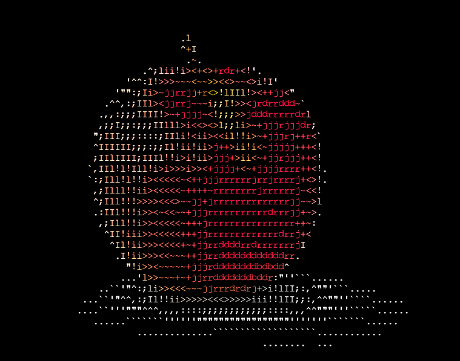
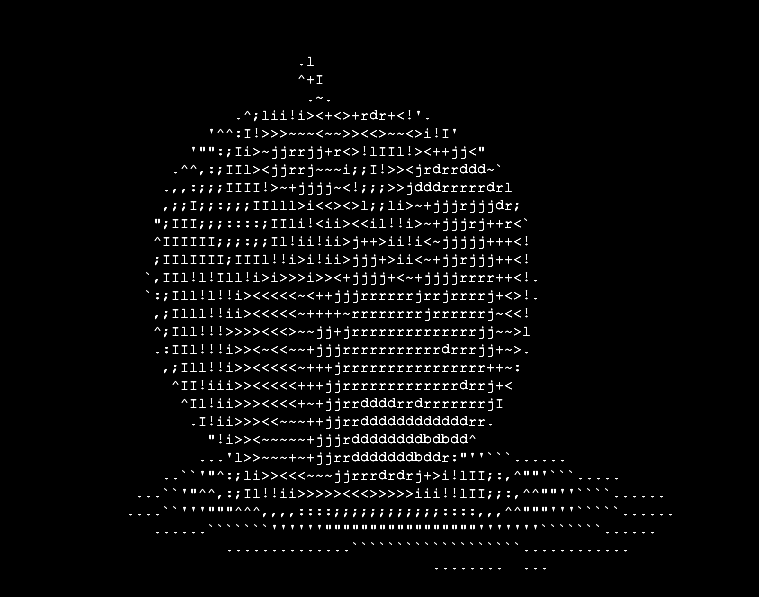
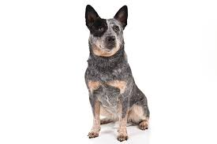
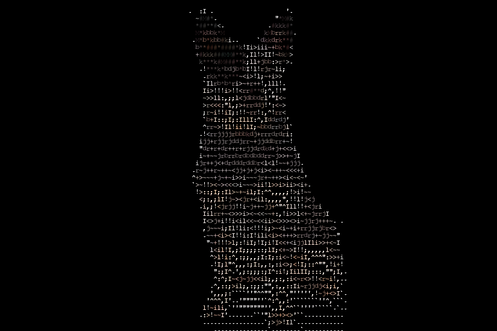
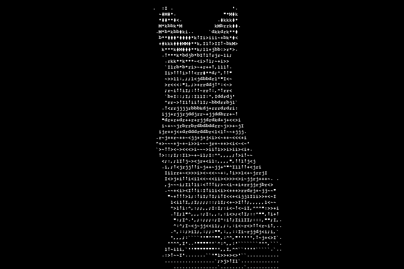

## Image to ASCII (text) converter
A personal project made for fun  
It needs optimizations  

### How to run:
Requires two Python modules: __Numpy__ and __Pillow__  
Run the script with the command: __python3 main.py__  

### Output examples:  

| Original Image | Output color | Output black & white |
| ----------- | ----------- | ----------- |
|  |  |  |
|  |  |  |

### Note:  
Works best with images that have a white background. Also great with logos, etc

### To do:
Better CLI interface  
Pre-process images that don't have a high contrast ratio before computing (and other pre-processing methods)  
Automatically pick the best scaling ratio based on original dimension of the image as another user option  
Later add other useful user options, create a user interface

_Contains functions that deal with pixel arrays of 1D or 3D. Also other various array computations, mapping pixel to characters, etc_
